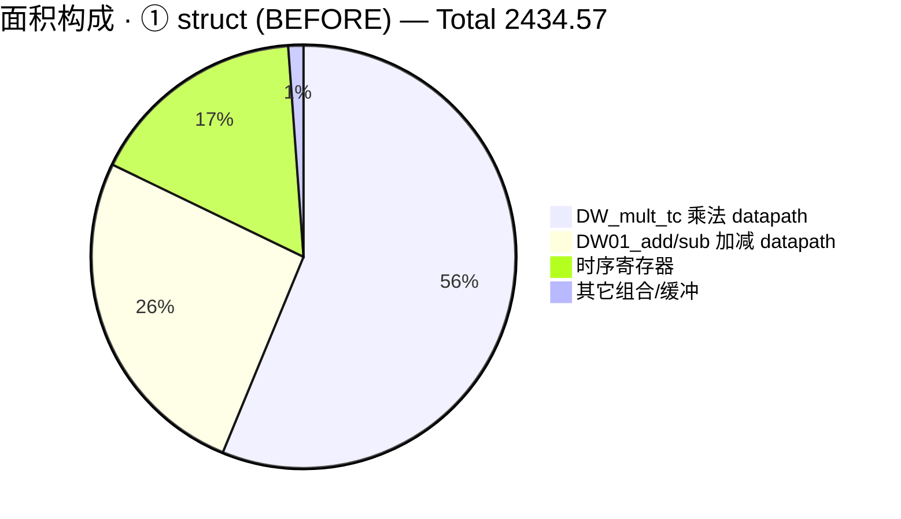
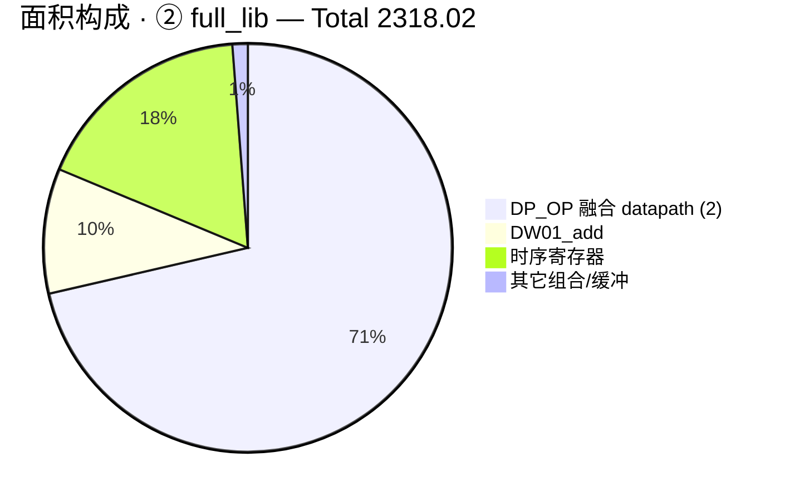
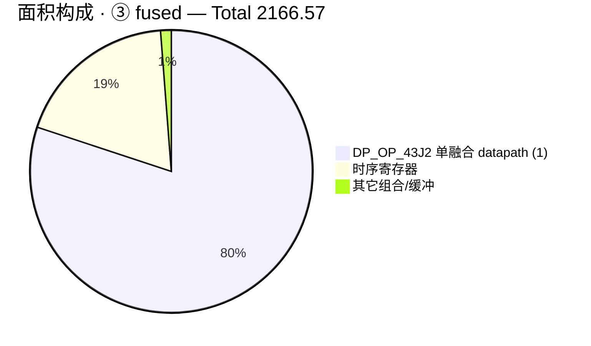

# G_PE 算术单元替换（compact → arithmetic_unit_full）面积/时序/功耗对比总结

> 目的：验证"把 L_PJG 成阵（systolic）相关模块中的算术单元替换为 `arithmetic_unit_full` 的完整实现"这一改造方向的收益。
> 以 **G_PE**（G 矩阵更新的 systolic 处理元）为具体例子，在**完全相同的综合约束**下对
> 「compact（替换前）」「full-library 组件级替换（替换后-lib）」「full-library 融合 MAC（替换后-fused）」三种实现做综合对比，
> 并给出整个 L_PJG 中其它成阵相关模块的替换映射表与可行性评估。

---

## 0. 被测对象与三种实现

### 0.1 G_PE 结构（compact，替换前基线）

G_PE 是 G_systolic_array 中的核心处理元，其算术通路为：

```
G_in (2 lane) ──┐
                ├─ complex_multiplier (Gauss 3 乘法)  ──> mul0/mul1
H_conj (2 lane) ─┘                                          │
                                                             v
                     G_reg (累加寄存器) ─┐            complex_adder (2:1 树)
                                        └──> adder_out[0] = G_reg + adder_out[1]  (adder_out[1]=mul0+mul1)
                                             │
                                             v
                                       G_out[0]/G_out[1] (store/output 寄存器)
```

- `SYSTOLIC_PARALLEL = 2`：每周期做 2 个复数乘法并累加（`G_reg += H_conj·G_in`）。
- **compact 版本使用的 `complex_multiplier`**（[rtl/arithmetic_unit/complex_multiplier.sv](L_PJG/rtl/arithmetic_unit/complex_multiplier.sv)）：
  - Gauss 3 乘法算法，但通过**实例化 3 个 `real_multiplier` 子模块**（`u_real_mul_x/y/z`）实现；
  - **逐级截位**：预加/预减 (A±A/B+B) 先截到 `+1` 整数位宽，每个 `x/y/z` 乘法结果各自独立截位到 `OUT_REAL_QTZ`，再做 `x−y / x−z` 减法。
- 注意：G_PE 用的是普通 `complex_multiplier`，**不是**同文件里的 `complex_multiplier_fast` / `complex_multiplier_using_fp` / `complex_multiplier_DP_reused`。

### 0.2 替换后三种实现（variant 矩阵）

| 变体 | 代号 | RTL | 替换内容 |
|---|---|---|---|
| ① 替换前基线 | **struct** | `rtl/compact/*` + `G_PE.sv` | compact 算术库（Gauss=3×`real_multiplier` 实例 + 逐级截位） |
| ② 组件级替换 | **full_lib** | `rtl/full/*` + `G_PE.sv`（**同一份 G_PE.sv 不改动**） | 仅把 `complex_multiplier` 换成 full 版（`FAST_MODE_EN=0` 时同为 Gauss，但**行内 `*` 全精度、输出单次截位**）；`complex_adder`/`real_adder` 两库字节级相同，无需改 |
| ③ 融合 MAC 替换 | **fused** | `rtl/full/complex_mac.sv` + `G_PE_fused.sv` | 把"2 lane 乘法 + complex_adder 树 + G_reg 累加"整段融合为**一个 `complex_mac_w_bias`**（`MUL_IN_PAIR_NUM=2`, `FAST_MODE_EN=0`），G_PE 全部时序寄存器（187 个）原样保留 |

> ② 与 ① 的唯一差异 = `complex_multiplier` 的实现方式（模块名/端口/量化参数完全一致 → 真正的"即插即用"组件替换）；
> ③ 是 ② 之上的进一步"乘法+累加融合"改造，需要新建 `G_PE_fused.sv`（位于 [g_pe_area_compare/rtl/G_PE_fused.sv](L_PJG/g_pe_area_compare/rtl/G_PE_fused.sv)）。
> 三个变体**时序寄存器数量均为 187**，属于干净的"同基线"对比（面积差基本全部来自组合逻辑，即算术实现本身）。

---

## 1. 综合条件

三个变体使用**同一套约束**（复用项目 Template 的 run_syn 流程），仅文件清单不同：

| 项目 | 设置 |
|---|---|
| 综合工具 | Synopsys Design Compiler **J-2014.09-SP3**（logic mode，非 topology） |
| 工艺库 | TSMC28 HPC+（`tcbn28hpcplusbwp30p140`），TT / **0.9V** / 25°C |
| 时钟 | **800 MHz（周期 1.25 ns）**，setup uncertainty +20%，无 retime |
| 时钟门控 | simple clock gating |
| 其它 | max_fanout 128；DesignWare 库自动推断（datapath 算子是 **DP_OP/DW*（estimated 面积）**） |

> 面积中乘法/加法 datapath 由 DC 以 DesignWare 合成算子（`DW_mult_tc`/`DW01_*`/`DP_OP`）估算，三个变体方法一致、可横向比较。

---

## 2. 面积对比（主表）

报告出处见附录。单位 µm²。

| 指标 | ① struct (BEFORE) | ② full_lib (替换后-lib) | ③ fused (替换后-fused) | ② vs ① | ③ vs ① |
|---|---:|---:|---:|---:|---:|
| **Total cell area** | **2434.57** | **2318.02** | **2166.57** | **−116.55 (−4.79%)** | **−268.00 (−11.0%)** |
| Combinational area | 2028.73 | 1912.30 | 1761.23 | −116.42 (−5.74%) | −267.50 (−13.2%) |
| Noncombinational (时序) area | 405.85 | 405.72 | 405.34 | −0.13 | −0.50 |
| Buf/Inv area | 95.51 | 63.63 | 61.99 | −31.88 (−33.4%) | −33.52 (−35.1%) |
| Leaf cells | 2728 | 2226 | 1836 | −502 (−18.4%) | −892 (−32.7%) |
| └ 组合 cell | 2541 | 2039 | 1649 | −502 | −892 |
| └ 时序 cell | **187** | **187** | **187** | 0 | 0 |
| Hierarchical cells | 28 | 22 | 15 | −6 | −13 |
| cells / nets / ports | 116 / 590 / 286 | 116 / 590 / 286 | 116 / 473 / 286 | — | — |
| datapath 合成面积占比 | 2000.57 (82.2%) | 1884.07 (81.3%) | 1734.75 (80.1%) | — | — |

datapath（DesignWare 合成算子）分解：

| 变体 | datapath 明细 |
|---|---|
| ① struct | `DW_mult_tc` ×6 = **1368.60**（56.2%）＋ `DW01_add` ×8 = 335.27（13.8%）＋ `DW01_sub` ×6 = 296.70（12.2%）|
| ② full_lib | `DP_OP_16J2...`（str）×2 = **1654.85**（71.4%）＋ `DW01_add` ×4 = 229.22（9.9%）|
| ③ fused | `DP_OP_43J2...`（str）×1 = **1734.75**（80.1%）|







---

## 3. 逻辑级数与时序对比

| 指标 | ① struct | ② full_lib | ③ fused |
|---|---:|---:|---:|
| Levels of logic | 33 | 33 | 32 |
| Critical path length (ns) | 0.98 | 0.98 | 0.98 |
| WNS / TNS（setup，1.25ns） | 0.00 / 0.00（0 违例） | 0.00 / 0.00（0 违例） | 0.00 / 0.00（0 违例） |
| Hold（未做 CTS，属正常） | 187 违例 | 187 违例 | 187 违例 |

三个变体在 **800 MHz 全部收敛、无 setup 违例**；关键路径 ~0.98 ns（约 1.25ns 的 78%），留有余量。
面积优化没有以牺牲时序为代价——融合后的 datapath 逻辑级数还少了 1 级（33→32）。

---

## 4. 功耗对比（方向性参考）

DC low-effort 功耗估算，输入无翻转率标注（PWR-414/415），**只能看方向、不能当作绝对值**：

| 指标 | ① struct | ② full_lib | ③ fused |
|---|---:|---:|---:|
| Total power (mW) | **1.258** | **1.218** | **1.230** |
| Switch / Internal (mW) | 0.519 / 0.727 | 0.497 / 0.709 | ~0.501 / ~0.719 |
| 泄漏 (nW) | 1.23e4 | 1.15e4 | —（略低） |

分层功耗显示（数据来源见附录）：
- 功耗主体是**乘法器/融合 datapath**：① 中每个 lane 的 compact `complex_multiplier` ≈0.235 mW（由 3 个 `real_multiplier` 子模块组成，各 ~0.056~0.062 mW），两 lane 合计 ~0.47 mW ≈ 37%；② 中每个 full `complex_multiplier` ≈0.214 mW（无子模块，行内 `*`），合计 ~0.43 mW；③ 中整个 `u_mac (complex_mac_w_bias)` ≈0.508 mW ≈ 41%。
- 时序寄存器功耗三个变体基本一致（G_reg / G_out / H_conj / H 各 reg 数值相近），与 187 寄存器不变的面积结论自洽。
- 融合版（③）面积最省但功耗略高于组件替换版（②），二者都在 ① 之下；差异在 low-effort + 无翻转率标注下属于估算噪声量级，暂不做强结论。

---

## 5. 面积节省来源分析

1. **①→②（组件级替换，−4.79%）**：唯一改动是 `complex_multiplier` 从"实例化 3×`real_multiplier`"改为"行内 `*` 的 Gauss 全精度实现"。
   - compact 每 lane 产生 **3 个独立的 Wallace 乘法器（`DW_mult_tc`）**，且 Gauss 预加/预减、每个 x/y/z 各自截位 → 中间网络与进位逻辑冗余；
   - full 版把预加做成行内全精度、乘法与输出合并，DC 自动融合出 **`DP_OP` 算子**，乘法器从 6 个独立 `DW_mult_tc` 归并为更宽、更省的融合 datapath，同时去掉大量中间截位/扩展逻辑与缓冲（buf/inv 面积 −33.4%）。
2. **①→③（融合 MAC，−11.0%）**：在②基础上把"2 lane 乘法 + complex_adder 累加树 + G_reg 累加"整段融合为**单个 `complex_mac_w_bias`**。
   - DC 把整条 `InputC + Σ(InputA·InputB)` 数据通路合成为**一个 `DP_OP_43J2`（1734.75 µm²）**，替代②中 2 个 `DP_OP` + 4 个 `DW01_add` 的累加结构；
   - 进位传播路径共享、中间节点与缓冲进一步减少：buf/inv 面积 −35%，leaf cell −892（−33%），组合 cell 从 2541 → 1649。
3. 时序寄存器（187 个）三个变体**完全一致** → 说明面积差 100% 来自组合/算术实现本身，对比是干净的。

**结论：** 即使不做任何 RTL 结构改造（②，仅换库文件），G_PE 面积即可省 ~4.8%；配合成阵级 MAC 融合（③），可省 ~11.0%；投影到整个 G_systolic_array / LPJG_unit（成阵相关算术占组合面积主体）收益会进一步放大。

---

## 6. L_PJG 成阵相关模块 → arithmetic_unit_full 替换映射表

> 「成阵相关」= G_systolic_array（G 更新/匹配滤波阵列）与 iter_unit（LPJG 迭代单元）中直接例化算术库的模块。
> 已在本次 G_PE 例子中实际综合验证的部分标 ✅，未综合但结构相同/可行的标 ○。
> **2026-09-06 更新**：除 PE 融合（③）外，L_PJG **整机**的组件级替换已全部落地——因 `complex_multiplier` 之外的所有同名单元两库**字节级相同**，AFTER filelist 统一指向 `arithmetic_unit_full/` 即完成替换（bit-safe），整机 FC 复验 **0/32**（见 [整机综合对比准备计划.md](./整机综合对比准备计划.md)）。PE 级融合（G_PE ③ / G_PE_diag / MF_PE）也已在工作树应用并整机 FC 0/32 通过（Option B 语义）。

| L_PJG 现有模块（compact 用法） | 使用的算术单元 | arithmetic_unit_full 替换方案 | 可行性 / 备注 |
|---|---|---|---|
| **G_PE.sv** | `complex_multiplier`＋`complex_adder`＋累加 reg | **组件级**：换成 full `complex_multiplier`（同名/同端口/同量化参数，多一个 `FAST_MODE_EN` 可选参数默认 0，即插即用）；**融合级**：整 PE 换 `complex_mac_w_bias`（新建 `G_PE_fused.sv`） | ✅ 已综合验证（②−4.8% / ③−11.0%）；需按 §8 做位精确性回归 |
| **G_PE_diag.sv**（对角 PE） | `complex_multiplier`＋`complex_adder` | 同 G_PE（G_out[1] 不存储，只是把第二个输出寄存器省掉，不影响算术替换） | ○ 结构一致，同样适用；未单独综合 |
| **MF_PE.sv**（匹配滤波 PE） | `complex_multiplier`（H_conj×y）＋`complex_adder` 归约树＋y_mf 累加 reg | 组件级：换 full `complex_multiplier`／`complex_adder`；融合级：归约+累加可考虑 `real_mac_w_bias`（对实部/虚部分别） | ○ 结构同 G_PE 模式（per-lane mul + adder 树 + 累加），适用性高；未综合 |
| **A_systolic_array.sv**（阵列顶层） | 例化 G_PE/G_PE_diag ＋ `complex_conj`（H 共轭）＋`real_adder`＋控制 | PE 在子模块层被替换后自动继承；`complex_conj`/`real_adder` 两库**字节级相同**，无需改动 | ✅ 无需额外替换；最终收益≈PE 数×PE 节省 |
| **LPJG_unit.sv**（迭代单元） | `complex_multiplier`、`complex_adder`、`complex_real_multiplier`、手写 `ADDER_TREE`（real_adder/complex_adder） | 组件级：换 full `complex_multiplier`／`complex_adder`／`complex_real_multiplier`；手写归约树 → `complex_adder_tree`／`real_adder_tree`（full 库新增）；迭代 MAC 通路 → `complex_mac`/`real_mac(_w_bias)` 融合 | **组件级 ✅ 已落地（2026-09-06）**：`complex_multiplier` 前轮已换 full；其余单元两库**字节级相同**，已随 AFTER filelist 统一指向 `arithmetic_unit_full/`（bit-safe），整机 FC 复验 0/32。**结构级**（`ADDER_TREE`/迭代 MAC 融合）○ 可行但风险大、收益小——累加路径已按 full 语义（全宽累加+单次截位）工作并与 golden 逐位一致，**不建议再融合** |
| PI_buffer / SP_Ram_array | 非算术（存储） | 不在本次替换范围 | — |

**full 库相对 compact 库的新增/可用模块**（见 [arithmetic_unit/](L_PJG/arithmetic_unit/)）：`complex_mac.sv`（含 `complex_mac_w_bias`、`complex_mac`）、`real_mac.sv`（含 `real_mac_w_bias`、`real_mac`）、`complex_adder_tree.sv`、`real_adder_tree.sv`；
两库**文件名与接口相同**的：`complex_adder`、`real_adder`、`complex_conj`、`real_addsub`/`complex_addsub`、`real_negative`/`complex_negative`、`complex_real_multiplier`、`reciprocal_lut`、`real_multiplier`（含 `_using_fp`/`_DP_reused` 变体）。
**唯一内容实质不同的组件是 `complex_multiplier`**：compact=实例化 `real_multiplier`＋逐级截位；full=行内 `*` 全精度＋单次输出截位（这也是 ② 变体面积差 −4.8% 的来源）。

---

## 7. 位精确性说明（重要 caveat）

- compact 版算术为**逐级截位**（Gauss 预加先截到 +1 int、每个 x/y/z 各自截位到输出位宽再做减法）；
- full 版 `complex_multiplier` / `complex_mac_w_bias` 为**内部全精度、输出单次截位**（full-width accumulate）；
- 因此 **full 替换后与 compact 在最低几位上并非 bit-exact**（一般误差在量化步长量级，属于"更精确"的方向），但**会改变逐拍数值**，必须重新跑功能回归。
- 回归手段：本项目已有 [testbench_fc.sv](L_PJG/testbench_fc.sv)（VCS FC:PASS 的 G 更新/匹配滤波自检激励）。若把 `G_PE_fused.sv` 或 full 库真正集成进顶层，需以同一激励对比替换前后的 `G_out`/`y_mf_out`，误差阈值按量化精度设定。
- 在综合对比之外，**补做了一次 standalone 差分功能验证**（`G_PE` vs `G_PE_fused`，同一 testbench 双路自检，EDA VCS2014 上 **PASS**，复现见 [sim/](L_PJG/g_pe_area_compare/sim/)）：
  - **干净码型**（fp6 偶数码、乘积可被 `G_MAC_QTZ` 精确表示）8 拍窗口内两路 `G_reg`/`G_out` **逐拍 bit-identical（diff==0）**——证明两条数据通路/时序 plumbing 完全一致；
  - **随机码型**窗口内两路差异**有界**：仅 40-bit 累加器上半部（实/虚各 20 bit）低 ~3 LSB（实测最大 `|ΔG_reg| ≈ 3,145,729 ≈ 3×2²⁰`，且逐窗口有界、不随时间累积）——是"compact 逐级截位 vs full 全精度+单次截位"的**预期中间舍入差**，非结构/逻辑错误；两路各自 `SELF_CHECK` 均 PASS。
  - 工具与复现：[run_gpe_diff_vcs.sh](L_PJG/g_pe_area_compare/sim/run_gpe_diff_vcs.sh)（EDA 双路编译+运行）、[compare_gpe_diff.py](L_PJG/g_pe_area_compare/sim/compare_gpe_diff.py)（按 LSB 原则设阈值：`tol_reg = 16×2²⁰`、`tol_out = 16×2¹⁵`），样例 trace 见 [trace_c.txt](L_PJG/g_pe_area_compare/sim/trace_c.txt) / [trace_f.txt](L_PJG/g_pe_area_compare/sim/trace_f.txt)。
- **EDA VCS2014 精化（elaboration）说明**：full 库 [complex_mac.sv](L_PJG/arithmetic_unit/complex_mac.sv) 原本把一串链式 `get_qtz()` struct localparam 声明在 `generate (FAST/NORMAL)` 分支内部——VCS2014 对"generate 块内链式 struct localparam"报 `Error-[NCE] Non-constant expression`，只有 VCS2016（WSL）/DC（J-2014.09-SP3）能精化。为让 full 库也能在 EDA VCS2014 下仿真，已把两处 NORMAL 分支的链式 localparam **上提到 module scope**（纯常量声明搬移、语义不变）：
  - 该改动已合入**正库** `arithmetic_unit/complex_mac.sv`，并用同一 DC 流程重跑 fused 综合复验：**面积逐字节不变（Total 2166.57 / Comb 1761.23 / Noncomb 405.34）**，证明对综合零影响；
  - 验证副本 [rtl/full/complex_mac_vcs.sv](L_PJG/g_pe_area_compare/rtl/full/complex_mac_vcs.sv)（VCS filelist 用此副本）与正库内容一致（LF）。
- 顶层集成（把 `G_PE_fused.sv`/full 库真正接入 `A_systolic_array`/`LPJG_unit`）后的位精确性回归仍留待集成阶段，方法同上（同一激励对比 `G_out`/`y_mf_out`，阈值按量化精度设定）。

---

## 8. 复现方法

EDA 工作区：`/home/asic03/graduate/proj_hujinjie/g_pe_area_test/`（本仓库镜像见 [L_PJG/g_pe_area_compare/](L_PJG/g_pe_area_compare/)）。

三个变体共用 Template run_syn 流程（`dc_shell -f Template/syn/script/run_syn.tcl -x "set cfg <cfg>"`，cfg 指向各自 config）：

| 变体 | config | filelist（rtl 根 `g_pe_area_test/`） |
|---|---|---|
| ① struct | `syn/config/g_pe_struct.tcl` | `rtl/compact/{complex_multiplier,real_multiplier,complex_adder,real_adder}.sv` ＋ `rtl/dfflr.sv` ＋ `rtl/G_PE.sv` |
| ② full_lib | `syn/config/g_pe_full_lib.tcl` | `rtl/full/{complex_multiplier,complex_adder,real_adder}.sv` ＋ `rtl/dfflr.sv` ＋ `rtl/G_PE.sv`（同①的 G_PE.sv；无需 real_multiplier） |
| ③ fused | `syn/config/g_pe_fused.tcl` | `rtl/full/complex_mac.sv` ＋ `rtl/dfflr.sv` ＋ `rtl/G_PE_fused.sv` |

日志：`syn/gpe_struct.log`、`gpe_full_lib.log`、`gpe_fused.log`（三跑均 rc=0）。

---

## 9. 结论

1. **组件级替换**（仅把 `complex_multiplier` 换成 arithmetic_unit_full 版，G_PE.sv 不动）在 800MHz 收敛前提下使 G_PE 总面积 **−4.79%**（组合 −5.74%，buf/inv −33.4%），是"零 RTL 改造、纯换库"的**无风险起步**；
2. **融合 MAC 替换**（新建 `G_PE_fused.sv`，整 PE 用单个 `complex_mac_w_bias`）进一步做到 **−11.0%** 总面积、leaf cell −32.7%、逻辑级数 33→32、仍 800MHz 收敛；
3. 三个变体时序寄存器均 187、功耗均 ≤ 基线，面积收益**不来自砍寄存器**，而来自乘法器实现方式（6×独立 `DW_mult_tc` → 融合 `DP_OP`）与"乘法+累加"融合；
4. 成阵其它模块（G_PE_diag / MF_PE / A_systolic_array / LPJG_unit）与 G_PE 同为"per-lane complex_multiplier + adder 树 + 累加"模式，替换映射表见 §6，可把 G_PE 结论推广；
5. **注意**：full 库是"全精度内部、单次输出截位"，与 compact 逐级截位**不 bit-exact**，集成前必须用 testbench_fc 重新做功能回归并设定量化误差阈值（§7）。

---

## 附录：报告出处（EDA 服务器）

| 变体 | run 目录 | 报告 |
|---|---|---|
| ① struct | `/home/asic03/graduate/proj_hujinjie/g_pe_area_test/syn/run_struct/G_PE/20260905_194404/rpt/` | `G_PE.{area,qor,power}` |
| ② full_lib | `/home/asic03/graduate/proj_hujinjie/g_pe_area_test/syn/run_full_lib/G_PE/20260905_194716/rpt/` | `G_PE.{area,qor,power}` |
| ③ fused | `/home/asic03/graduate/proj_hujinjie/g_pe_area_test/syn/run_fused/G_PE_fused/20260905_195017/rpt/` | `G_PE_fused.{area,qor,power}` |
| ③′ fused（hoist 后复验） | `/home/asic03/graduate/proj_hujinjie/g_pe_area_test/syn/run_fused/G_PE_fused/20260905_202609/rpt/` | `G_PE_fused.{area,qor,power}`（与 ③ 逐字节一致，见 §7） |

*注：所有 datapath 面积均为 DC 的 DesignWare/DP_OP estimated 面积（`Subtotal of datapath(DP_OP) cell area: ... (estimated)`），三个变体方法一致，横向可比。*
