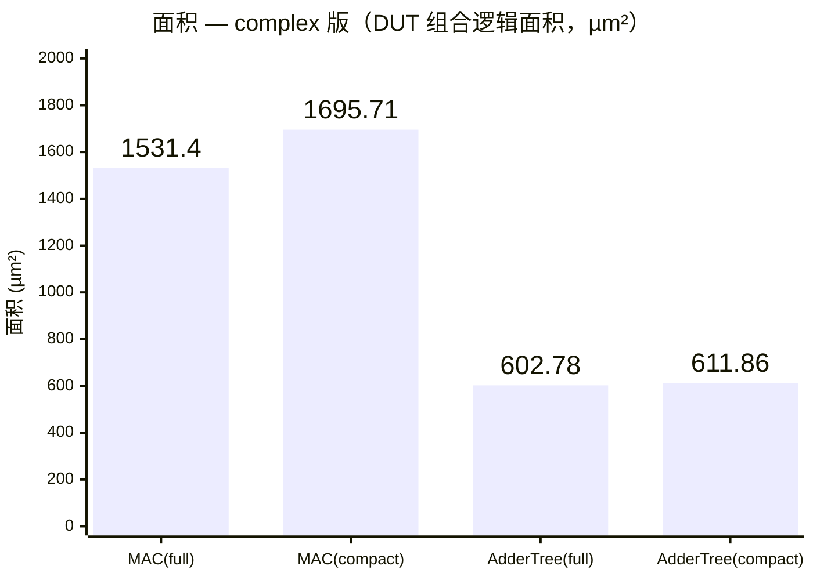
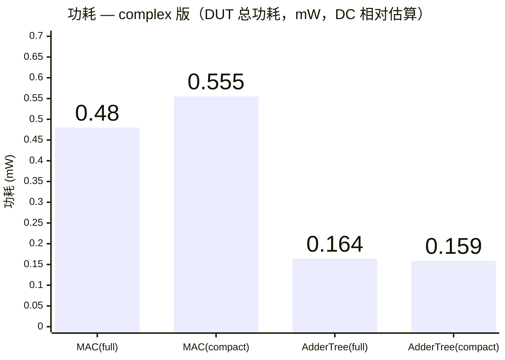
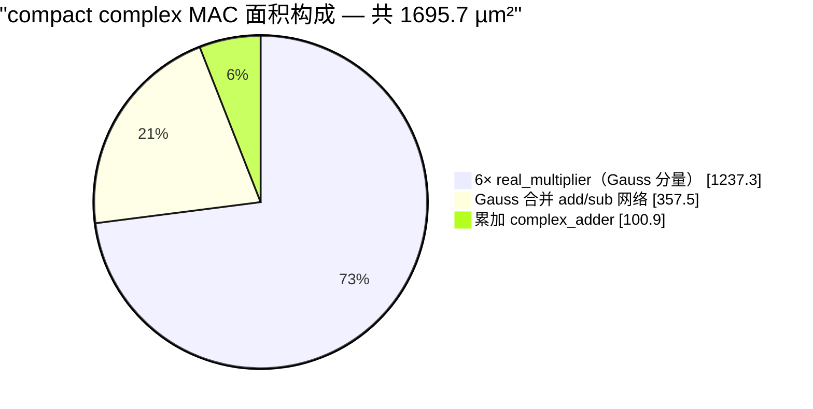
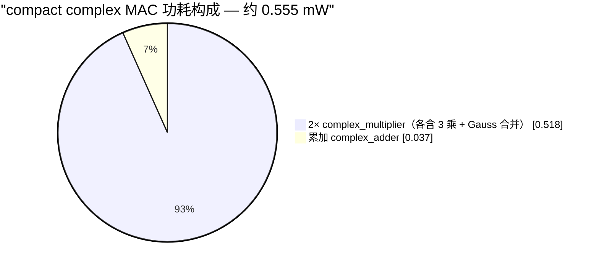
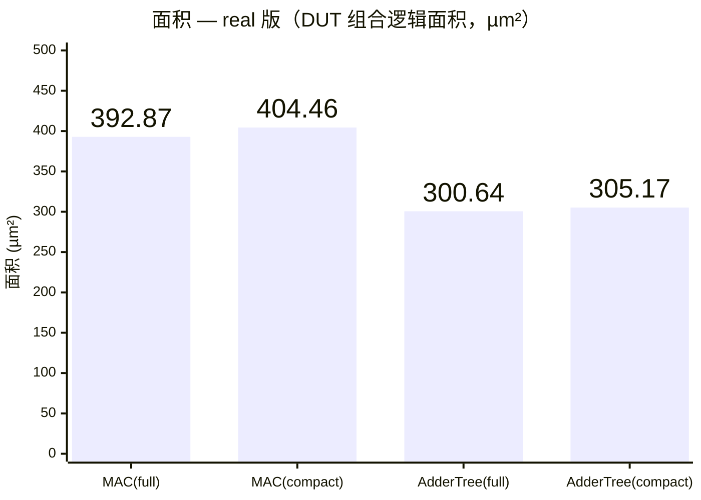
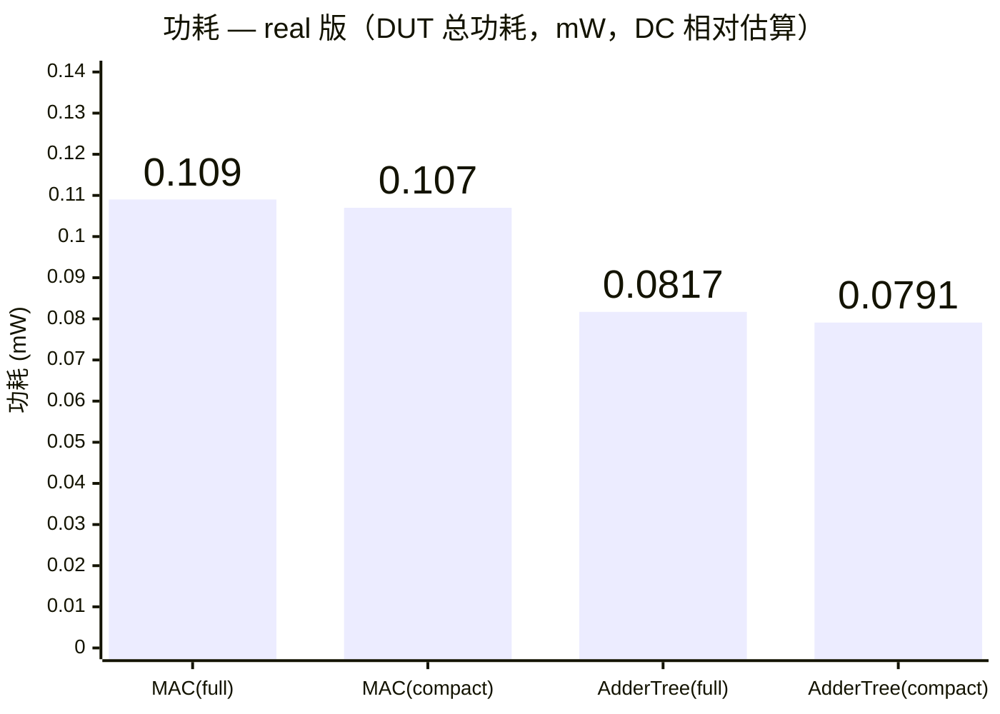
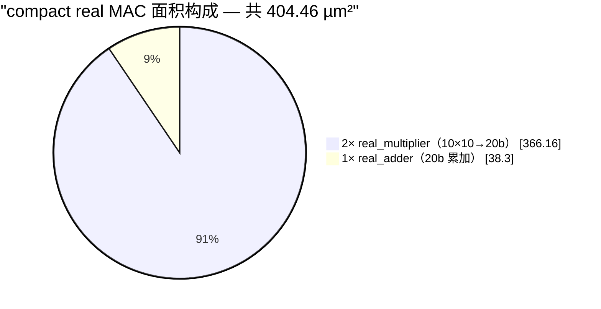
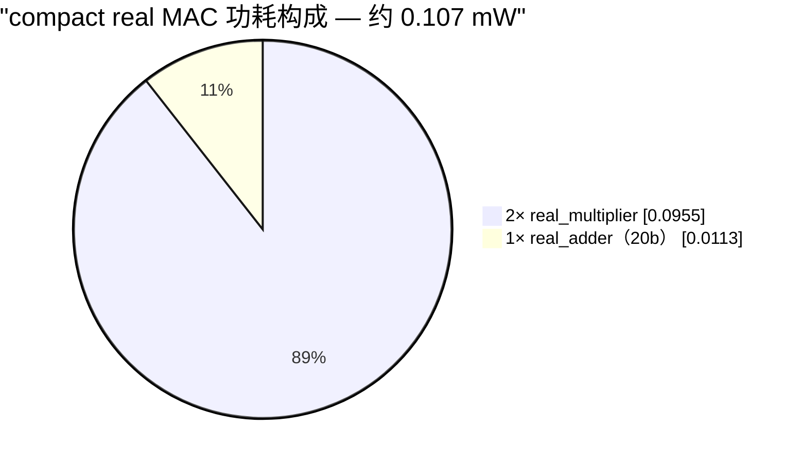

# arithmetic_area 面积对比总结（full 全精度 vs compact 结构截位）

> 工程：`/home/asic03/graduate/proj_hujinjie/arithmetic_area_test`（EDA 服务器）
> 综合：Synopsys DC J-2014.09-SP3（logic 模式，compile_ultra）
> 被测 RTL：`arithmetic_unit_full`（封装全精度） vs `arithmetic_unit_compact`（L_PJG 风格、逐级截位）
> 日期：2026-09-03

---

## 0. 测试条件（按需求设定，两套实现完全一致，保证公平）

| 项目 | 设定 |
|---|---|
| 工艺 / 库 | TSMC 28nm，TT 角 `tcbn28hpcplusbwp30p140tt0p9v25c_ccs` |
| 频率 | 800 MHz（时钟周期 1.25 ns） |
| 过约束 | +20% setup clock uncertainty（0.25 ns） |
| 流程 | DC logic 模式，compile_ultra，保留层次以便逐实例取面积 |
| 对比口径 | 每个 DUT 外包输入/输出寄存器做成同步块（组合逻辑 = DUT 逻辑）；两实现 wrapper 寄存器数量相同，只比**组合（DUT）逻辑面积**，寄存器面积作参考 |
| 结论一致性 | 4 个 top 全部 WNS=0.00、setup 0 违例 → 面积都是在**同样时序收敛**下比较的；hold 违例属 CTS 前正常现象（未做修 hold 流程），不影响面积对比 |

测试矩阵（参数与对应数量取自 L_PJG 的 G_PE / iter，已与你确认）：

| top | DUT | 参数 | 组合结构 |
|---|---|---|---|
| mac_full_top / mac_struct_top | complex MAC（乘累加） | H_QTZ 入（10b 实部×2=20b 复数），G_MAC_QTZ 出（20b×2=40b 复数），N=2 对 | Gauss 3 乘法/复乘 × 2 对 + 累加 |
| adder_full_top / adder_struct_top | complex adder tree（8 输入求和） | GD_ACC_QTZ（21b 实部×2=42b 复数），8 输入 | 7 级 balanced complex_adder 树 |

---

## 1. 面积对比总表（单位 µm²）

### ① MAC（组合逻辑 = DUT；noncombinational = wrapper 寄存器）
| 实现 | DUT 组合面积 | 分解（实测逐实例） | 寄存器 (noncomb) | 总面积 |
|---|---|---|---|---|
| **full** `mac_full_top` | **1531.40** | 单个融合数据通路 `DP_OP`（u_dut=1530.14），DC 估计 1555 | 296.10 | **1827.50** |
| **compact** `mac_struct_top` | **1695.71** | 2× complex_multiplier (794.93+799.85) + 1× complex_adder(累加, 100.93)；内含 6× real_multiplier | 305.68 | **2001.38** |
| 差值 | **full 省 164.3（9.7%）** | | ≈省 9.6（寄存器基本相当） | **full 省 173.9（8.7%）** |

→ **compact 比 full 大 ≈8.7%（含 wrapper）≈9.7%（仅 DUT）**；所有 top 都在 800MHz+20% over-constraint 下 0 setup 违例。

### ② Adder tree
| 实现 | DUT 组合面积 | 分解（实测逐实例） | 寄存器 (noncomb) | 总面积 |
|---|---|---|---|---|
| **full** `adder_full_top` | **602.78** | u_dut=601.27 = 2× real_adder_tree（各 300.64，内部全精度逐级生长、末端一次截位） | 883.76 | **1486.55** |
| **compact** `adder_struct_top` | **611.86** | 7× complex_adder（各 87.19 = 2× real_adder 43.60），每级截位到 21b | 883.76 | **1495.62** |
| 差值 | **full 省 9.1（1.5%，基本持平）** | | 相同 | **full 省 9.1（0.6%）** |

→ **纯加法树两实现几乎无差别**（<2%）。

### ③ 功耗（DC `report_power` 分层估算，总功耗 mW；动态为主、泄漏 <1%）
> 说明：本流程未喂 VCD/SAIF，DC 用 low-effort **零延时仿真 + 默认翻转率(≈0.5)** 传播切换活性（有 PWR-414/415 unannotated 警告）；预 CTS、无时钟树/门控功耗，网表 ZeroWireload。数值只反映**纯逻辑单元+网内部功耗的相对估算**，仅在同实现对（full↔compact、同 wrapper、同激励假设）之间做方向性对比有效，不能当实测值。

| 电路 | full（u_dut 总功耗） | compact（DUT 分解求和） | 差距（DUT） | 整块 top（含同构 wrapper 寄存器） |
|---|---|---|---|---|
| complex MAC | **0.480**（complex_mac） | **0.555** = 2× complex_multiplier（0.262 + 0.256）+ 累加 complex_adder（0.037） | **full 省 13.5%**（与面积 9.7% 同向且更显著） | full 1.059 vs struct 1.143（struct +7.9%） |
| complex adder tree | 0.164（complex_adder_tree，=2× real_adder_tree 0.082） | 0.159 = 7× complex_adder（按级 0.019–0.028） | **基本持平**（struct 略低 2.9%） | full 1.587 vs struct 1.584（持平） |

→ 功耗结论与面积一致：**complex MAC 上 full 明显更省**，纯加法树两实现基本持平。

### ④ 图形化总览（Mermaid，complex 版）

**面积柱状图**（横轴逐项 = 实现×电路，同电路 full/compact 相邻便于比高矮；柱顶数字为各模块面积值 µm²；complex 与 real 分两张图）

**功耗柱状图**（柱顶数字为 DUT 总功耗 mW）

**compact MAC 面积 / 功耗构成（饼状图）** —— 理解 full 到底"省在哪"：面积上乘法器是大头（73%），full 把乘法器 + Gauss 合并 + 累加器融合成单一数据通路（u_dut 1530.1 µm²，无独立子块可分解），把这些重复开销消掉，故省 9.7%；功耗同样以乘法器为主，full 省 13.5%。

> 功耗为 DC 相对估算（默认翻转率、无 VCD/SAIF），仅作同实现对的方向性对比。real 版对应图表见附录 A。

---

## 2. compact 下单个乘法器 / 加法器的面积（实测，TSMC TT 28nm @800MHz+20%unc）

### 乘法器 real_multiplier（在 compact 的 complex_multiplier 内，Gauss 分量）
- 位宽：实部输入 10b（有符号，`get_qtz(1,3,6,REAL)`），Gauss 预加/预减项 11b；输出到 20b（G_MAC 实部）。
- 6 个实测：208.026 / 204.498 / 206.010 / 208.404 / 205.002 / 205.380
- **单乘法器 ≈ 205–208 µm²，平均 ≈ 206 µm²**（独立 DW_mult_tc apparch/Wallace 实现）。

### 加法器 real_adder（两种上下文实测值不同，与位宽/负载有关）
| 上下文 | 位宽 | 单加法器面积 | 说明 |
|---|---|---|---|
| compact adder tree | 21b+21b→21b（GD_ACC 实部，每级截位） | **43.60 µm²**（14 个全部一致） | 输入来自寄存器，负载小，可视为"裸加法器"参考值 |
| compact MAC 的累加 complex_adder 内 | 20b+20b→20b（G_MAC 实部） | **≈50 µm²**（50.15 / 50.78） | 输入来自乘法器输出，负载/驱动更强，DC 会加大 cell |

### 组合单元面积速查（compact 结构，直接实例化后测得）
| 单元 | 位宽 | 面积 | 备注 |
|---|---|---|---|
| real_multiplier | ≈10×11b→20b | **≈206 µm²** | Gauss 分量乘法器 |
| real_adder | 21b→21b | **≈43.6 µm²** | adder tree 内 |
| real_adder | 20b→20b | **≈50 µm²** | MAC 累加内（高负载） |
| complex_multiplier | H_QTZ→G_MAC_QTZ | ≈795–800 µm² | = 3×real_multiplier(≈618) + Gauss 合并逻辑(≈176–181) |
| complex_adder | 42b 复数（树） | ≈87.2 µm² | = 2×real_adder(21b) |
| complex_adder | 40b 复数（MAC 累加） | ≈100.9 µm² | = 2×real_adder(20b) |

**直观结论：一个乘法器 ≈ 4.7 个加法器面积**（206 / 43.6）——在 MAC 这类模块里，**乘法器就是面积绝对大头**（compact MAC 中 6 个乘法器共 ≈1237 µm²，占 DUT 73%）。

---

## 3. 整体面积降低主要来自哪一块？

### MAC 的 ≈166 µm²（≈10%）主要省在「乘法器及其合并/累加网络的实现方式」，而非寄存器、也非进位宽度本身

**compact 版 DUT 的分解**（1695.71 µm²）：
| 组成部分 | 面积 | 占 DUT |
|---|---|---|
| 6× real_multiplier（Gauss 分量，独立 DW_mult_tc Wallace） | ≈1237.3（MUL0 618.5 + MUL1 618.8） | **73.0%** |
| 2× complex_multiplier 内 Gauss 合并 add/sub（x−y、x−z 本地逻辑） | ≈357.5（176.4 + 181.1） | 21.1% |
| 累加 complex_adder（2× real_adder） | 100.9 | 5.9% |
| 合计 | 1695.7 | 100% |

**full 版**：同样的 Gauss 3 乘法 × 2 对 + 累加数学，但乘法用**内联 `*` 全精度写进一个大表达式**，DC 将其整成**单一 DP_OP 融合数据通路**（u_dut=1530.14，估计 1555）。

**省在哪的定量陈述**：
- full 的**整个** MAC 数据通路（1530.1）比 compact 的**乘法器 + Gauss 合并两块**（1237.3 + 357.5 = 1594.8）还要小——即 full 用融合结构"免费"覆盖了 compact 还要再单独付的累加加法器（100.9），还多省了 ≈64.7 µm²，合计 ≈166 µm² 的差距全部来自**这块乘-加数据通路**。
- 原因：compact 把 6 个乘法做成**彼此独立的 Wallace（DW_mult_tc）宏**，每个在模块输出边界先把积**截到 20b**，再靠独立的**全宽 add/sub 网络**做 Gauss 合并、再靠独立 adder 累加——这些乘法器与后续加法**无法共享压缩树/部分积**，截位点也多；full 让 DC 在**单一数据通路内**做乘-加融合（CSA 折叠），6 个乘法的结果直接喂给与压缩树合并的累加逻辑，**只在最终输出截位一次**。
- 佐证：**adder tree 两实现只差 1.5%**（纯加法、无乘法器、位宽增长仅 3bit），说明**面积差异主要由"乘法器如何被例化/融合"决定**，而不是截位策略本身在作怪；寄存器（wrapper）两版几乎相同，不贡献差异。

### Adder tree 为什么几乎无差别
无乘法器参与；full 逐级全精度（中间只长 ≈3 bit）vs compact 每级截到 21b，两者都是 ≈7 级、宽度相近的加法网络，单加法器 ≈43.6 µm² 量级相同 → 差值仅 ≈9 µm²（1.5%）。注意该 top 寄存器（883.8）占大头，DUT 逻辑只占 ≈40%，选型不受面积驱动。

---

## 4. 结论

1. **MAC（乘加密集）：full 全精度封装明显更省面积（≈10%）**，采用 full 更优。省下的面积几乎全部来自**乘法器及其合并/累加网络**：full 把 2 对复乘（Gauss 3×2=6 个乘法）与累加融合成单个 DP_OP 数据通路，避免 compact 6 个独立 Wallace 乘法器 + 逐级全宽加法网络 + 多次截位的重复开销。
2. **Adder tree（纯加法）：两实现面积基本无差别（<2%）**，选型应看时序/功耗/数值精度等其他指标。
3. 单单元面积参考（TSMC TT 28nm、800MHz 收敛下，logic cell area）：**≈10×11b 乘法器 ≈ 206 µm²；21b 加法器 ≈ 43.6 µm²**（乘法器 ≈ 4.7× 加法器）。
4. 全部 4 个版本在 800MHz + 20% 过约束下 **0 setup 违例**（hold 违例为 CTS 前正常）。

> 数据出处（服务器，可复查）：`arithmetic_area_test/syn/<top>/2026*/rpt/{area,modulearea,qor,power}`
> 报告 run：mac_struct_top→20260903_180422；mac_full_top / adder_full_top / adder_struct_top→20260903_180809

---

# 附录 A：实数（REAL）版对比 —— 同量化、同电路下 full vs compact

> 追加于 2026-09-03，与上文 complex 版同方法、同约束（TSMC 28nm TT、800MHz+20% unc、外包输入/输出寄存器），仅把被测模块换成**实数域**实现，验证在去掉复数 Gauss 结构后 full/compact 的面积差距是否仍在。
> 四个 top：`real_mac_full_top` / `real_mac_struct_top` / `real_adder_full_top` / `real_adder_struct_top`，全部 setup WNS=0.00、0 违例。

## A.0 测试矩阵（与 complex 版同功能、同量化位宽，实数）

| top | DUT | 参数 | 组合结构 |
|---|---|---|---|
| real_mac_full_top | 实数 MAC（乘累加） | A/B=real H_QTZ（10b 有符号），N=2 对，出 G_MAC real 20b | full `real_mac`：2 内联 `*` 全精度乘 + 全精度累加 + 末端一次截位 |
| real_mac_struct_top | 同上 | 同上 | 2× compact `real_multiplier`(10b×10b→20b) + 1× compact `real_adder`(20b) 求和 |
| real_adder_full_top | 实数 adder tree（8 输入求和） | in/out=GD_ACC real 21b，ADD_NUM=8 | full `real_adder_tree`：内部全精度逐级生长、末端一次截位 |
| real_adder_struct_top | 同上 | 同上 | 7× compact `real_adder`(21b) 平衡二叉树，每级截位到 21b |

两实现 wrapper 完全同构（real MAC：4×10b 入 + 20b 出；real adder tree：8×21b 入 + 21b 出），寄存器面积逐对相同，差异全部落在 DUT 组合逻辑上。

## A.1 面积对比总表（单位 µm²）

### ① real MAC（组合逻辑 = DUT；noncomb = wrapper 寄存器）
| 实现 | DUT 组合面积 | 分解（实测逐实例） | 寄存器 (noncomb) | 总面积 |
|---|---|---|---|---|
| **full** `real_mac_full_top` | **392.87** | u_dut(real_mac)=392.87，单一融合数据通路 | 136.08 | **544.07** |
| **compact** `real_mac_struct_top` | **404.46** | 2× real_multiplier（183.08+183.08）+ 1× real_adder 20b（38.30） | 136.08 | **555.66** |
| 差值 | **full 省 11.59（2.9%）** | | 相同 | **full 省 11.59（2.1%）** |

### ② real adder tree
| 实现 | DUT 组合面积 | 分解（实测逐实例） | 寄存器 (noncomb) | 总面积 |
|---|---|---|---|---|
| **full** `real_adder_full_top` | **300.64** | u_dut(real_adder_tree)=300.64，内部全精度 + 末端截位 | 441.88 | **743.27** |
| **compact** `real_adder_struct_top` | **305.17** | 7× real_adder 21b（43.60×7） | 441.88 | **747.81** |
| 差值 | **full 省 4.54（1.5%）** | | 相同 | **full 省 4.54（0.6%）** |

### ③ 功耗（DC `report_power` 分层估算，总功耗 mW；动态为主、泄漏 <1%）
> 说明：与 complex 版相同，本流程未喂 VCD/SAIF，DC 以 low-effort 零延时仿真 + 默认翻转率(≈0.5) 传播切换活性（PWR-414/415 unannotated 警告）；预 CTS、无时钟树/门控功耗。数值为纯逻辑单元+网内部功耗的**相对估算**，仅在同实现对（full↔compact，wrapper 与激励假设相同）间做方向性对比有效。

| 电路 | full（u_dut 总功耗） | compact（DUT 分解求和） | 差距（DUT） | 整块 top（含同构 wrapper 寄存器） |
|---|---|---|---|---|
| real MAC | 0.109（real_mac 融合） | 0.107 = 2× real_multiplier（0.0480 + 0.0475）+ real_adder 20b（0.0113） | **基本持平**（struct 略低 2.0%） | full 0.380 vs struct 0.379（持平） |
| real adder tree | 0.0817（real_adder_tree） | 0.0791 = 7× real_adder（L1 级 ≈0.013–0.014、L2/top ≈0.0094–0.0097） | **基本持平**（struct 略低 3.2%） | full 0.790 vs struct 0.788（持平） |

→ **功耗与面积结论同向**：real 域两电路 full/compact 功耗几乎无差别（面积上 full 微优 ≈1.5–3%，功耗上 struct 微低 ≈2–3%，都在估算噪声内，视为持平）；与 complex MAC 上 full 明显更省（功耗 13.5%）形成对照。

### A.1c 图形化总览（Mermaid，real 版）

**面积柱状图**（柱顶数字为各模块面积值 µm²）

**功耗柱状图**（柱顶数字为 DUT 总功耗 mW）

**compact real MAC 面积 / 功耗构成（饼状图）** —— real MAC 中乘法器占比比 complex 版更高（90.5% 面积 / 89.4% 功耗），full 融合仅省掉"2 个乘法器边界各自截位 + 1 个独立累加器"的那点开销，故 full 优势收窄到 ≈3%（面积）甚至持平（功耗）。

## A.2 compact（实数结构）下单个乘法器 / 加法器面积（实测）
| 单元 | 位宽 | 面积 | 功耗（总, mW，结构内实测） | 出处 |
|---|---|---|---|---|
| real_multiplier | 10b×10b→20b（两输入同为 H_QTZ 实数） | **183.08 µm²**（2 个实例完全一致） | **0.048**（MUL_0 0.0480 / MUL_1 0.0475） | real_mac_struct 内 MUL_0/MUL_1 |
| real_adder | 20b+20b→20b（MAC 累加） | **38.30 µm²** | **0.0113** | real_mac_struct 内 SUM2 |
| real_adder | 21b+21b→21b（adder tree，每级截位） | **43.60 µm²**（7 个实例完全一致） | **0.0094–0.014**（L1 级 0.013–0.014、L2/top 0.0094–0.0097，位置/负载相关） | real_adder_struct 内 7× u_add |

- 实数版乘法器（10×10→20b）比 complex 版里的 real_multiplier（Gauss 预加 10×11→20b，≈206 µm²）小 ≈11%，因为少了 Gauss 预加/预减的 1 bit 展宽与合并逻辑。
- 乘法器 : 加法器 ≈ **183.1 / 43.6 ≈ 4.2×**（对 21b 树）；对 20b 累加器则 ≈ 183.1 / 38.3 ≈ 4.8×。
- 同一位宽的 20b real_adder 在 real_mac_struct（38.3）比 complex MAC 累加场景（≈50）小，因该处驱动来自乘法器输出的高扇出/大负载会让 DC 加大 cell；这里加两个乘法器输出的负载较轻。

## A.3 面积差主要来自哪一块？（real 版）

**real MAC 省下的 11.6 µm²（2.9%）几乎全部来自「把末端累加+截位融进乘法数据通路」：**
- compact 基准：2 个独立 real_multiplier = 366.16 µm²（每个在自己的输出边界截位到 20b），另需一个独立 20b real_adder = 38.30 做求和，DUT 共 404.46。
- full：DC 把 2 个内联乘法 + 累加 + 末端一次截位合成单一数据通路（392.87）。相对于"2 个裸乘法器 366.16"，full 的累加+最终截位只多花 ≈26.7 µm² —— 即把 compact 单独付 38.30 的累加器省掉，并借部分积共享再省一点，净省 ≈11.6 µm²。
- 寄存器（wrapper）两版相同，不贡献差异。

**real adder tree：几乎没省（4.5 µm² / 1.5%）**：full 每级全精度加法（中间只多长 1–2 bit）vs compact 每级截回 21b，都是 ≈7 个近等宽加法器，单级 ≈43.6 µm² 量级相同，属进位/截位网络边界效应的微小差别。

## A.4 real 版 vs complex 版结论对照（full 优势从何而来）

| 电路 | complex 版 full 省（面积 / 功耗） | real 版 full 省（面积 / 功耗） |
|---|---|---|
| MAC | **9.7% / 13.5%**（DUT，功耗上 full 更优且方向一致） | **2.9% / ≈0%**（面积 full 微优；功耗 struct 略低 2.0%，视为持平） |
| Adder tree | 1.5% / ≈0%（功耗 struct 略低 2.9%） | 1.5% / ≈0%（功耗 struct 略低 3.2%） |

1. **纯加法树无论复数还是实数，full/compact 都几乎持平（<2%）**——加法器本身已近最优，截位策略只差 ≈1 bit 进位宽度，可忽略。
2. **MAC 的 full 优势高度依赖复数 Gauss 结构**：complex 版 compact 要在每个 complex_multiplier 边界把 3 个实数部分积各自截到 20b、再用独立全宽 add/sub 网络做 Gauss 合并、再做累加——重复的截位点与全宽合并网络是 ≈10% 差距的来源；full 把 6 乘 + 合并 + 累加合成单个 DP_OP，把这些重复开销全部消掉。
3. **实数 MAC 没有 Gauss 合并层**，compact 的"重复开销"只剩每乘法器一次边界截位 + 一个独立累加器，故 full 的优势收窄到 ≈3%（仅剩融合累加器与部分积共享的收益）。
4. 结论：**选 full 的核心理由在复数（Gauss）数据通路与数值精度（单次截位）；若电路是实数 MAC 或纯加法树，full/compact 面积几乎无差别**，此时应按时序/功耗/数值精度/是否需匹配 L_PJG 结构选型。real 版两个 full 结构在 800MHz+20% 下 0 setup 违例。

> 数据出处（服务器，可复查）：`arithmetic_area_test/syn/real_{mac,adder}_{full,struct}_top/<date>/rpt/*.{area,modulearea,qor,power}`
> 报告 run：real_mac_full_top→20260903_185750；real_mac_struct_top / real_adder_full_top / real_adder_struct_top→20260903_190016
